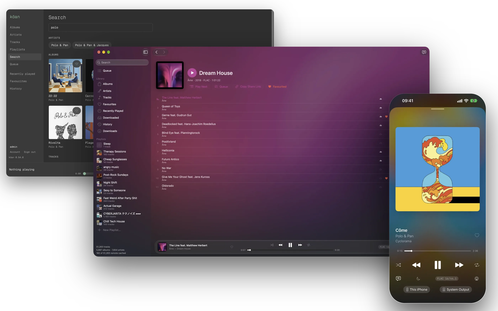

# kōan

A music player and server for your own library, local or on any OpenSubsonic server: native SwiftUI apps on macOS and iOS, a terminal UI on macOS and Linux, and a server with a web UI, on one Rust core. [koan.rocks](https://koan.rocks)

It's a music player and server, for local collections and remote ones (anything OpenSubsonic). Remote libraries sit behind a fairly aggressive local cache. It handles multi-terabyte libraries with ease and has all the core audio features you'd want, like gapless and bit-perfect output (where the system allows). It's built from 25 years of messing about with music, being annoyed with pretty much everything, and wanting my dream application.

The idea is to be fully compatible with the existing ecosystem while bringing the decent UX and modern ideas that professionally made streaming services have. It started as a little cross-platform CLI and TUI app on a Rust core. Now there's a native SwiftUI macOS app (no Electron) that links that core directly, an iOS app, a server, and soon a tvOS app. The UX takes what I like about Apple Music and fb2k and fixes the things I thought were dumb. The point is to do the basics properly before adding features, and I'm really proud of it.

I wanted UX that makes it easy as hell to do what you want, while staying SUPER low on resources (and now battery). And I wanted the stuff you don't really see in the self-hosted space: device control and handoff, EQ profiles and convolution, DLNA output (with EQ!), and a cache built for a commuter who often has no signal, so you never have to remember to download your whole queue first. The best of every world, why not?

My philosophy is that you should lead with your opinions, but let people customise and tweak them to match theirs.

Because it grew organically, and I've insisted on staying compatible with OpenSubsonic, every part works on its own. You can use the macOS app with Navidrome. You can use the server with Arpeggi. Or you can use kōan all the way down and get the non-standard (sorry) features such as remote control. I think a shared standard like OpenSubsonic is incredibly important so everyone plays nicely together, but it shouldn't stop us experimenting to compete with how well the professional streaming platforms integrate.

One thing I've noticed: when you mix self-hosted apps with proprietary tech, say AirPlay from the fantastically solid play:Sub, you're treated as a second-class citizen. The audio has to stream over the wire from your phone, which is laggy. With kōan's remote features, the device you send it to plays its own copy.

I did use AI-assisted coding for this project. I've been building fairly high-quality software for a *loooong* time (decades) before AI existed, and I'd like to think the decisions reflect that rather than vibing slop. I probably could have written it myself, but I wanted to step back and be more of an architect, technical lead and product owner than the person typing out the code, as I'm just one person.

If it gets traction I'll happily look at more platforms like Android, but I'm already out $99 for an Apple Developer account, so I'm not shelling out for an Android phone just yet.

— [@radiosilence](https://github.com/radiosilence)

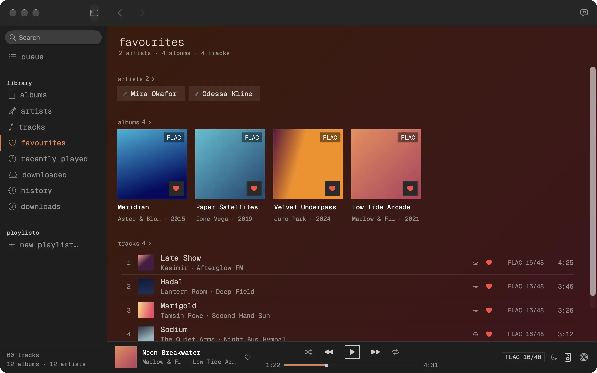 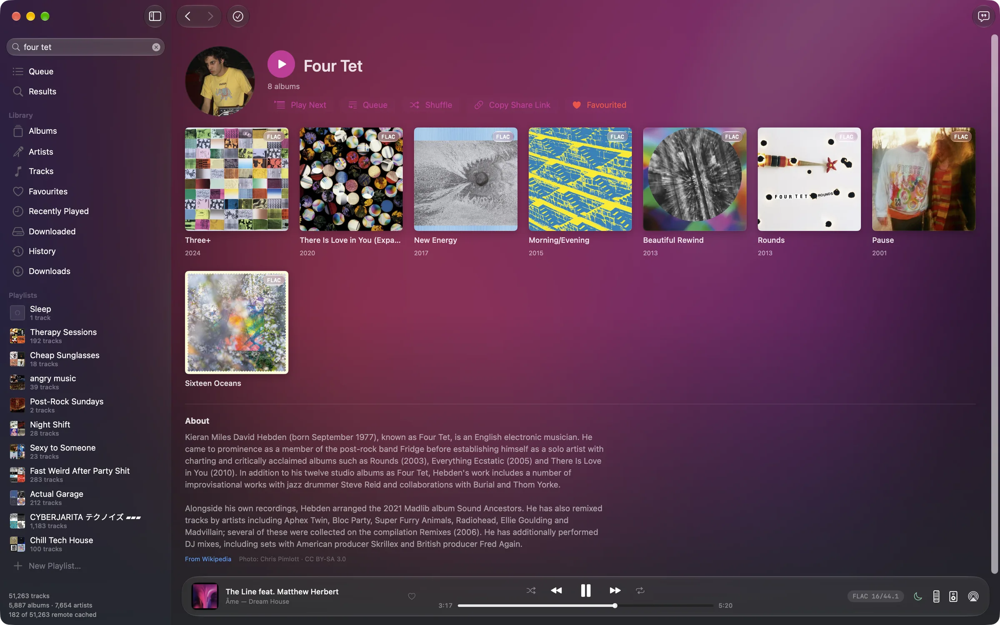

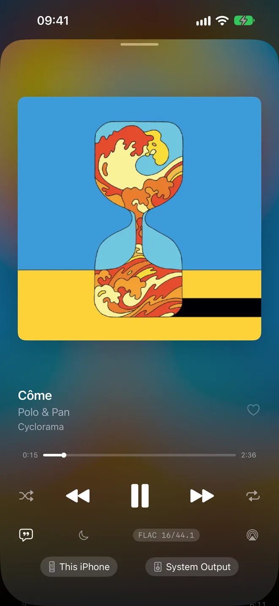 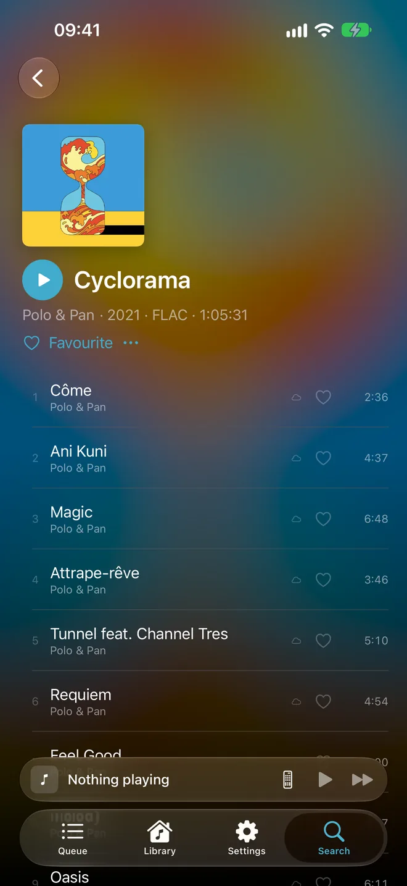 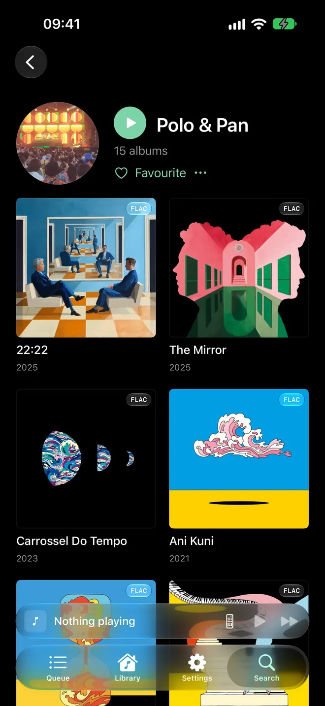 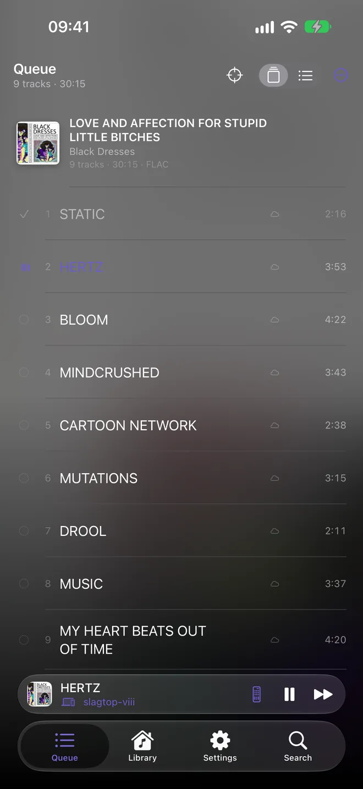 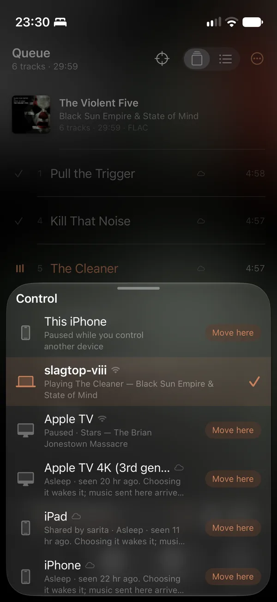

## Install

macOS App:

```bash
brew install --cask radiosilence/koan/koan-app
```

You may have to update brew's trust settings to trust the tap.
Alternatively, [download `Koan.dmg`](https://github.com/radiosilence/koan/releases/latest/download/Koan.dmg) from the latest release.

CLI/TUI:

```bash
# mise (recommended)
mise use -g github:radiosilence/koan@latest

# homebrew
brew install radiosilence/koan/koan

# or via cargo
cargo install koan-cli

# or build from source
git clone https://github.com/radiosilence/koan.git && cd koan
cargo install --path crates/koan-cli
```


Single binary. macOS needs nothing else. Linux needs the ALSA and D-Bus development headers:

```bash
# Debian/Ubuntu
sudo apt install libasound2-dev libdbus-1-dev

# Fedora
sudo dnf install alsa-lib-devel dbus-devel

# Arch
sudo pacman -S alsa-lib dbus
```

The iOS app is built from source for now: `just ios-phone` installs it on a plugged-in iPhone, signed with your own (free) Apple developer team. It needs iOS 26 and a kōan, Navidrome or other Subsonic server to play from.

## Quickstart (CLI)

```bash
koan config init                            # create config dir + commented template
# edit ~/.config/koan/config.local.toml:
#   [library]
#   folders = ["/path/to/your/music"]
koan scan                                   # index your library
koan                                        # launch the TUI
```

`space` to pause, `<`/`>` to skip, `p` to pick tracks, `a` for albums, `q` to quit.

The macOS app needs none of this: **Settings → Library** adds folders, **Settings → Server** signs in to a kōan, Navidrome or Subsonic server.

To run a server, play from Navidrome, or move off it, see the [documentation](https://koan.rocks/docs/).

## What it does

### Playback

- **Bit-perfect output** through CoreAudio on macOS and ALSA on Linux: the device is switched to the source's sample rate rather than resampled to reach it, and the format badge says when a device refuses.
- **Gapless**, including after the queue is edited: the decoder runs ahead across track boundaries, and an edit restarts it at the playhead.
- **EQ and convolution per output device.** Profiles are imported as other tools write them: AutoEQ, Equalizer APO configs with their includes, CamillaDSP, REW, rePhase, Convolver `.cfg` files and Roon's zips of impulse responses, one per sample rate. An output without a profile runs nothing. See [Equalisation and convolution](https://koan.rocks/docs/dsp/).
- **Network amplifiers and streamers** (UPnP/DLNA) get the original file, or, with a correction profile, one processed FLAC stream for the whole queue. See [Playing on another device](https://koan.rocks/docs/devices/).
- **Formats**: FLAC, MP3, AAC, Vorbis, Opus, ALAC, ADPCM, WAV, AIFF and CAF, in Ogg, Matroska/WebM and MP4.
- **ReplayGain** in track and album modes, a **sleep timer**, shuffle and repeat, and media keys through Control Center and MPRIS.

### Devices

- **Any kōan app controls any other**, on the same network directly or anywhere through a kōan server, and moves what is playing to it. The device it moves to plays its own copy, so it carries on when the phone sleeps.
- **A cache built for losing signal**: the queue is fetched ahead of the playhead as far as the cache limit allows, so it keeps playing underground. See [Cache management](https://koan.rocks/docs/cache-management/).
- **Signing in without a password**: invite links, approving another device by code, and app passwords for Subsonic apps that only sign in with a token. See [Authentication](https://koan.rocks/docs/authentication/).

### Library

- **Local files and a Subsonic or Navidrome server in one library**, with favourites and playlists synced both ways. Compilations stay one album, and one artist is one artist whatever the case or Unicode form.
- **Smart playlists**, including Navidrome's `.nsp` files and `.m3u` files in the library folders. See [Smart playlists](https://koan.rocks/docs/smart-playlists/).
- **Play history and Recently played**, shared between an account's devices.
- **Synced lyrics** from LRCLIB, and artist biographies and photos from Wikipedia.
- **Search** with SQLite FTS5, and an album-grouped queue with 100 levels of undo that survives restarts.
- **File organisation** with foobar2000-compatible format strings (59 `$functions()`), every move previewed first. kōan never writes your tags.

### As a server

`koan --headless`, or the container image, serves the library to everything else. See [Running a server](https://koan.rocks/docs/headless-server/), or [Migrating from Navidrome](https://koan.rocks/docs/migrating-from-navidrome/).

- **A web UI** laid out for a phone and a desktop, with gapless playback in the browser.
- **Share links** whose pages play without an account and unfurl with their cover.
- **An OpenSubsonic API**, so Subsonic apps play from it too, with ratings, bookmarks and transcoding to Opus, MP3 or AAC.
- **ListenBrainz scrobbling** per account, sent by the server.
- **MCP** at `/mcp` with its own sign-in, so an assistant such as Claude can browse the library and drive playback on your devices. It can never move, rename or delete a file. See [MCP integration](https://koan.rocks/docs/mcp-integration/).
- **GraphQL** for everything the apps can do.

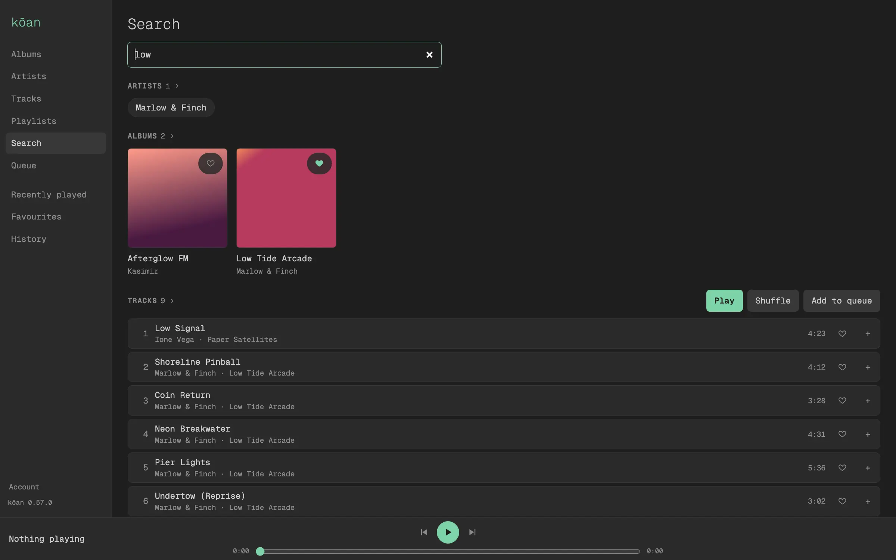 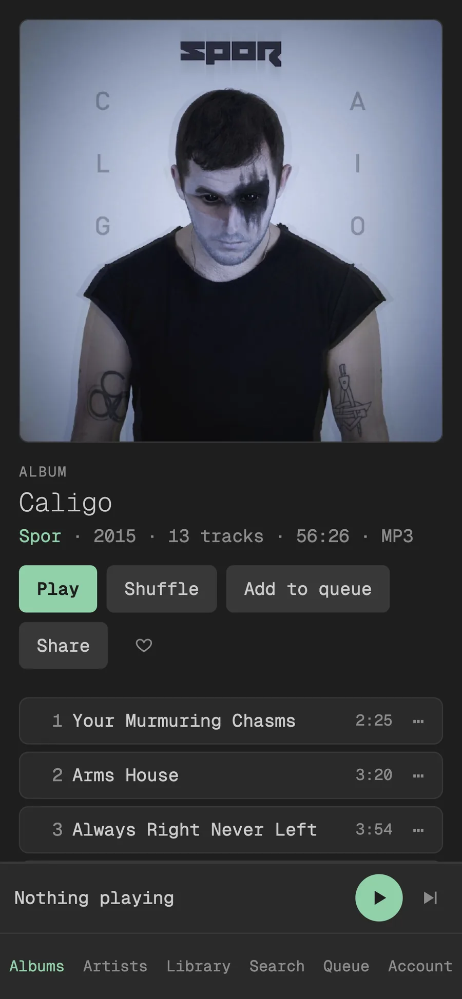

### The terminal UI

A full-screen Ratatui player on macOS and Linux: album art, an album-grouped queue, a fuzzy picker, a library browser, a lyrics panel, mouse support and 22 visualiser modes.

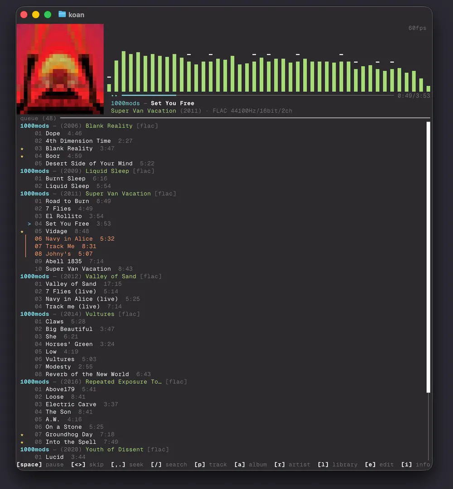 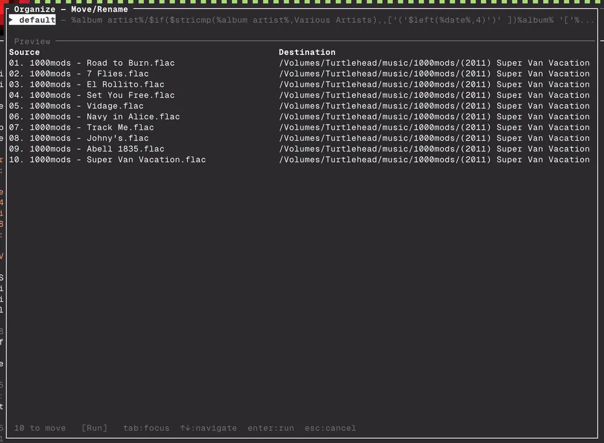

## How it compares

[koan.rocks/compare](https://koan.rocks/compare/) compares kōan feature by feature with Subsonic, Jellyfin and Plex apps for iPhone and Mac, desktop players including Roon and foobar2000, room-correction software and self-hosted servers. It covers what kōan does not do as well. The table below covers terminal players, which that page leaves out.

### TUI / terminal players

| | kōan | ncmpcpp | cmus | musikcube | termusic | rmpc | stmp |
|---|:---:|:---:|:---:|:---:|:---:|:---:|:---:|
| **Language** | Rust | C++ | C | C++ | Rust | Rust | Go |
| **Standalone** | **Yes** | No (MPD) | Yes | Yes | Yes | No (MPD) | No (Subsonic) |
| **Bit-perfect** | **Yes** | Via MPD | Via ALSA | No | No | Via MPD | No |
| **Gapless** | **Yes** | Yes | Yes | Yes | Yes | Yes | No |
| **Subsonic/Navidrome** | **Yes** | No | No | No | No | No | **Yes** |
| **Local library** | **Yes** | Via MPD | Yes | Yes | Yes | Via MPD | No |
| **Local + remote unified** | **Yes** | -- | -- | -- | -- | -- | -- |
| **Album art** | **Halfblock** | Kitty | No | No | Kitty/Sixel | Kitty/Sixel | No |
| **ReplayGain** | **Yes** | Via MPD | Yes | Yes | No | Via MPD | No |
| **fb2k format strings** | **59 functions** | Column fmt | Basic | No | No | Basic | No |
| **File organization** | **Yes** | No | No | No | No | No | No |
| **FTS search** | **SQLite FTS5** | MPD search | Filter | Text | Filter | MPD search | Basic |
| **Queue undo/redo** | **100-deep** | No | No | No | No | No | No |
| **Mouse support** | **Full** | Yes | Yes | Basic | Yes | Yes | No |
| **Media keys** | **macOS CC + MPRIS** | Via MPRIS | Via MPRIS | -- | Via MPRIS | Via MPRIS | -- |
| **Drag & drop** | **Finder -> TUI** | No | No | No | No | No | No |
| **Lyrics** | **Synced + plain** | Via MPD | No | Plugin | No | Via MPD | No |
| **Visualizer** | **22 modes** | No | No | No | No | No | No |
| **Favourites** | **Yes (syncs)** | Via MPD | No | Yes | No | Via MPD | **Yes** |
| **Streaming playback** | **Yes (256KB)** | Via MPD | No | No | No | Via MPD | **Yes** |
| **API / MCP** | **GraphQL + MCP** | MPD protocol | No | No | No | MPD protocol | No |
| **Tag editing** | No | Via MPD | No | Yes | Yes | Via MPD | No |
| **DSP / EQ** | **EQ + FIR** | Via MPD | Yes | Yes | No | Via MPD | No |
| **Auth** | **JWT + roles** | No | No | No | No | No | No |
| **Platforms** | macOS, Linux | Linux/macOS | Linux/macOS/BSD | Linux/macOS/Win | Linux/macOS/Win | Linux/macOS | Linux/macOS |

## Planned

- **Tag editing**: inline editing, bulk operations and a vimv-style external editor.
- **The Apple TV app**, signed in by pairing ([#752](https://github.com/radiosilence/koan/pull/752), [#782](https://github.com/radiosilence/koan/pull/782)).
- **Similar artists**, from MusicBrainz and Last.fm.

## Documentation

At [koan.rocks/docs](https://koan.rocks/docs/), rendered from [`docs/`](docs). Start with [Getting started](https://koan.rocks/docs/getting-started/), [Running a server](https://koan.rocks/docs/headless-server/) or [Migrating from Navidrome](https://koan.rocks/docs/migrating-from-navidrome/).

## Architecture

```
File -> Symphonia -> f32 samples -> rtrb ring buffer -> CoreAudio/cpal callback -> DAC
```

Five crates: `koan-core` (audio engine, player, database, indexer), `koan-tui` (Ratatui TUI, visualizers, media keys), `koan-server` (GraphQL, Subsonic REST, MCP), `koan-ffi` (uniffi bindings for native clients), and `koan-cli` (the `koan` binary). See [ARCHITECTURE.md](ARCHITECTURE.md) for the full technical manual.

The macOS app ([`apps/macos`](apps/macos)) links `koan-core` in-process through `koan-ffi` rather than talking to a server, and shares one library and config with the terminal UI. The iOS app is the same SwiftUI sources and engine in a phone's shell; its output crosses the system mixer, so bit-perfect is a claim for the Mac and Linux only.

## Dev

```bash
just check       # test + clippy
just fmt         # cargo fmt
just cli         # cargo run -p koan-cli -- <args>
just macos-run   # build and launch the macOS app
just macos-dmg   # package the macOS app for release
just ios-run     # build and launch the iOS app on a simulator
just ios-phone   # install on the iPhone plugged in, signed with your personal team
```

See [CONTRIBUTING.md](CONTRIBUTING.md) for guidelines.

## License

MIT
