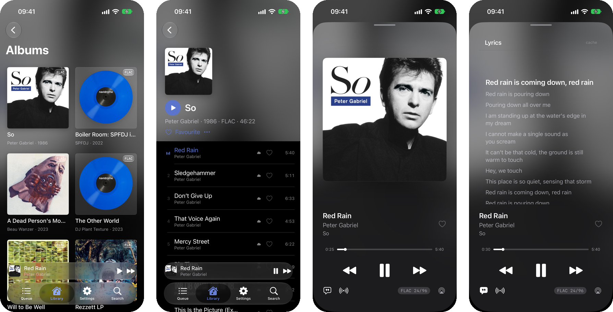

# kōan

[koan.rocks](https://koan.rocks)

It's a music player. Designed for both local and remote collections (subsonic/navidrome). Remote works with a fairly aggressive local cache. It is super fast and handles 1TB+ libraries with ease and has all the things you'd want like gapless, queue management, "bit-perfect" (so much as the audio stack allows), combined search...etc. Built from 25 years of experience messing about with music and being annoyed with pretty much everything and wanting my dream application. There are some organisational features such as file renaming, which is compatible with fb2k syntax, and I plan to add a decent well thought out tagger once I have pondered the UX more.

> Originally built as a Rust TUI and core, I've now added a beautiful macOS SwiftUI app (no Electron) that uses FFI to bridge to the rust. It's fast, it's pretty, it has these lush transitions, and the point is to do all the basics properly and well before adding features, I'm really proud of it. The UX is somewhat inspired by taking the things I like about Apple Music and fb2k, but also fixing things I thought were dumb.
>
> Full disclaimer: AI assisted coding was used. I have been building somewhat high quality software for a long time (decades) before AI existed, and I'd like to think the decisions I've been making reflect this as opposed to just vibing slop. I probably could have written it myself, but I kind of wanted to take a step back and be more of an architect/technical lead/product owner rather than a coder for this.
>
> — [@radiosilence](https://github.com/radiosilence)


## Install

macOS App:

```bash
brew install --cask radiosilence/koan/koan-app
```

You may have to update brew's trust settings to trust the tap.
Alternatively, [download `Koan.dmg`](https://github.com/radiosilence/koan/releases/latest/download/Koan.dmg) from the latest release.

CLI/TUI:

```bash
# mise (recommended)
mise use -g github:radiosilence/koan@latest

# homebrew
brew install radiosilence/koan/koan

# or via cargo
cargo install koan-cli

# or build from source
git clone https://github.com/radiosilence/koan.git && cd koan
cargo install --path crates/koan-cli
```


Single binary. macOS needs nothing else. Linux needs the ALSA and D-Bus development headers:

```bash
# Debian/Ubuntu
sudo apt install libasound2-dev libdbus-1-dev

# Fedora
sudo dnf install alsa-lib-devel dbus-devel

# Arch
sudo pacman -S alsa-lib dbus
```

## Quickstart (CLI)

```bash
koan config init                            # create config dir + commented template
# edit ~/.config/koan/config.local.toml:
#   [library]
#   folders = ["/path/to/your/music"]
koan scan                                   # index your library
koan                                        # launch the TUI
```

`space` to pause, `<`/`>` to skip, `p` to pick tracks, `a` for albums, `q` to quit.

The macOS app needs none of this: **Settings → Library** adds folders, **Settings → Server** signs in to a kōan, Navidrome or Subsonic server.

To run a server, play from Navidrome, or move off it, see the [documentation](https://koan.rocks/docs/).

## What it does

- **Bit-perfect playback** -- CoreAudio AUHAL / ALSA via cpal, the device switched to the source rate rather than resampled to reach it. When a device refuses the switch, the format badge says the output is resampled instead of claiming otherwise
- **Gapless transitions** -- decode thread keeps the ring buffer alive across track boundaries
- **Format support** -- FLAC, MP3, AAC, Vorbis, Opus, ALAC, ADPCM, WAV/AIFF/CAF, Ogg, MKV/WebM, MP4. Opus is decoded by `opus-decoder` rather than symphonia, which ships no Opus codec — mono and stereo, in Ogg, Matroska or WebM
- **Native macOS app** -- SwiftUI, built out of Liquid Glass. Album-grouped queue with drag reorder, playlists, library and artist browsing, ⌘K search, synced lyrics, play history, file organization, and first-run setup
- **Full-screen TUI** -- transport bar with album art, album-grouped queue, fuzzy picker, library browser, track info modal, visualizer, lyrics panel, mouse support
- **Authentication** -- Ed25519 JWT tokens, three roles (admin/user/readonly), 1Password CLI integration
- **Subsonic/Navidrome** -- library sync that runs when the server changes, unified local+remote browsing, streaming playback, two-way sync of favourites and playlists
- **Music server** -- run headless and kōan serves the library itself: a mobile-first web UI with gapless browser playback, share links (a track shares its album cued to it) that unfurl with their cover, and an OpenSubsonic API for Subsonic apps, signed in with a kōan account by password, token or API key. See [Running a server](https://koan.rocks/docs/headless-server/)
- **Playlists** -- ordered, named, reorderable; synced both ways with Navidrome, exportable as M3U8
- **ReplayGain** -- track and album modes with peak limiting and configurable pre-amp
- **Format strings** -- fb2k-compatible `%field%`, `[conditionals]`, `$functions()` — 59 of them — for display and file organization
- **File organization** -- rename/reorganize your library from the macOS app or the TUI using format string patterns
- **GraphQL API** -- alongside the app and TUI, or headless. Relay pagination, filters, and mutations for playback, the queue, favourites, playlists and the library
- **MCP server** -- a server serves MCP at `/mcp` with its own OAuth sign-in, acting as the signed-in account; `koan mcp` runs the player for a desktop client over stdio
- **Queue management** -- undo/redo (100-deep), multi-select, drag-reorder, Finder drag & drop, session persistence
- **SQLite FTS5 search** -- full-text search across your entire library
- **Media keys** -- macOS Control Center and Linux MPRIS (play/pause, next/prev, now playing info)
- **Lyrics** -- synced (LRC) and plain lyrics from LRCLIB, current line highlighting
- **22 visualizer modes** -- spectrum bars, oscilloscope, radial, particles, lissajous, spectrogram, stereo waveform, VU meter, flame, plasma, tunnel, wireframe, metaballs, starfield, terrain, moiré, kaleidoscope, julia fractal, spiral, interference, wormhole, matrix rain. Picker with live preview (`v`), matrix overlay (`X`), bass shake (`S`), configurable reactivity


## How it compares

No TUI player combines bit-perfect audio, Subsonic streaming, album art, fb2k-style format strings, and file organization in one binary. Most either need a daemon, lack remote support, or skip the audiophile bits.

### TUI / terminal players

| | kōan | ncmpcpp | cmus | musikcube | termusic | rmpc | stmp |
|---|:---:|:---:|:---:|:---:|:---:|:---:|:---:|
| **Language** | Rust | C++ | C | C++ | Rust | Rust | Go |
| **Standalone** | **Yes** | No (MPD) | Yes | Yes | Yes | No (MPD) | No (Subsonic) |
| **Bit-perfect** | **Yes** | Via MPD | Via ALSA | No | No | Via MPD | No |
| **Gapless** | **Yes** | Yes | Yes | Yes | Yes | Yes | No |
| **Subsonic/Navidrome** | **Yes** | No | No | No | No | No | **Yes** |
| **Local library** | **Yes** | Via MPD | Yes | Yes | Yes | Via MPD | No |
| **Local + remote unified** | **Yes** | -- | -- | -- | -- | -- | -- |
| **Album art** | **Halfblock** | Kitty | No | No | Kitty/Sixel | Kitty/Sixel | No |
| **ReplayGain** | **Yes** | Via MPD | Yes | Yes | No | Via MPD | No |
| **fb2k format strings** | **59 functions** | Column fmt | Basic | No | No | Basic | No |
| **File organization** | **Yes** | No | No | No | No | No | No |
| **FTS search** | **SQLite FTS5** | MPD search | Filter | Text | Filter | MPD search | Basic |
| **Queue undo/redo** | **100-deep** | No | No | No | No | No | No |
| **Mouse support** | **Full** | Yes | Yes | Basic | Yes | Yes | No |
| **Media keys** | **macOS CC + MPRIS** | Via MPRIS | Via MPRIS | -- | Via MPRIS | Via MPRIS | -- |
| **Drag & drop** | **Finder -> TUI** | No | No | No | No | No | No |
| **Lyrics** | **Synced + plain** | Via MPD | No | Plugin | No | Via MPD | No |
| **Visualizer** | **22 modes** | No | No | No | No | No | No |
| **Favourites** | **Yes (syncs)** | Via MPD | No | Yes | No | Via MPD | **Yes** |
| **Streaming playback** | **Yes (256KB)** | Via MPD | No | No | No | Via MPD | **Yes** |
| **API / MCP** | **GraphQL + MCP** | MPD protocol | No | No | No | MPD protocol | No |
| **Tag editing** | No | Via MPD | No | Yes | Yes | Via MPD | No |
| **DSP / EQ** | No | Via MPD | Yes | Yes | No | Via MPD | No |
| **Auth** | **JWT + roles** | No | No | No | No | No | No |
| **Platforms** | macOS, Linux | Linux/macOS | Linux/macOS/BSD | Linux/macOS/Win | Linux/macOS/Win | Linux/macOS | Linux/macOS |


### Desktop players (GUI)

| | kōan | foobar2000 | Strawberry | DeaDBeeF |
|---|:---:|:---:|:---:|:---:|
| **Type** | **Native GUI + TUI** | GUI | GUI (Qt) | GUI (GTK) |
| **Bit-perfect** | **Yes** | Yes (WASAPI/ASIO) | Yes (Linux) | Yes (ALSA) |
| **Gapless** | **Yes** | Yes | Yes | Yes |
| **Subsonic** | **Built-in** | Plugin | **Built-in** | No |
| **ReplayGain** | **Track + album** | Scan + apply | Yes | Scan + apply |
| **Format strings** | **fb2k-compat** | **The original** | Organizer only | fb2k-like |
| **File organization** | **Yes** | Yes (component) | **Yes** | No |
| **Queue undo/redo** | **100-deep** | Partial | No | Yes |
| **Lyrics** | **Synced + plain** | Plugin | No | Plugin |
| **Visualizer** | **22 modes** | Plugin | No | Plugin |
| **Tag editing** | No | **Yes** | Yes | **Yes** |
| **DSP / EQ** | No | **Yes (VST)** | Yes | Yes |
| **Platforms** | macOS (app + TUI), Linux (TUI) | Windows/macOS | All | All |


## Documentation

At [koan.rocks/docs](https://koan.rocks/docs/), rendered from [`docs/`](docs). Start with [Getting started](https://koan.rocks/docs/getting-started/), [Running a server](https://koan.rocks/docs/headless-server/) or [Migrating from Navidrome](https://koan.rocks/docs/migrating-from-navidrome/).

## Architecture

```
File -> Symphonia -> f32 samples -> rtrb ring buffer -> CoreAudio/cpal callback -> DAC
```

Five crates: `koan-core` (audio engine, player, database, indexer), `koan-tui` (Ratatui TUI, visualizers, media keys), `koan-server` (GraphQL, Subsonic REST, MCP), `koan-ffi` (uniffi bindings for native clients), and `koan-cli` (the `koan` binary). See [ARCHITECTURE.md](ARCHITECTURE.md) for the full technical manual.

## macOS app

A SwiftUI app in [`apps/macos`](apps/macos). It links `koan-core` in-process through `koan-ffi` rather than talking to a server, and shares one library and config with the TUI.

```bash
just macos-run     # build and launch
just macos-dmg     # package for release
```

Requires Swift 6 and macOS 26+.

## iOS app



The same SwiftUI app and engine in a phone's shell, playing from a server. Output crosses the system mixer, so bit-perfect is a claim for the Mac and Linux only.

```bash
just ios-run      # build and launch on a simulator
just ios-phone    # install on the iPhone plugged in, signed with your personal team
just ios-walk     # screenshot every page on a simulator
```

Requires iOS 26+.

## Playing on another device

Any kōan app can control another, and hand its queue to it. See [Playing on another device](https://koan.rocks/docs/devices/).

## Planned

- **Tag editing** -- inline editing, bulk operations, vimv-style external editor ([plan](/.claude/plans/04-tagging.md))
- **Similar artists** -- from MusicBrainz/Last.fm ([plan](/.claude/plans/09-artist-metadata.md))

## Dev

```bash
just check    # test + clippy
just fmt      # cargo fmt
just cli      # cargo run -p koan-cli -- <args>
just macos-run # build + launch the macOS app
```

See [CONTRIBUTING.md](CONTRIBUTING.md) for guidelines.

## License

MIT
