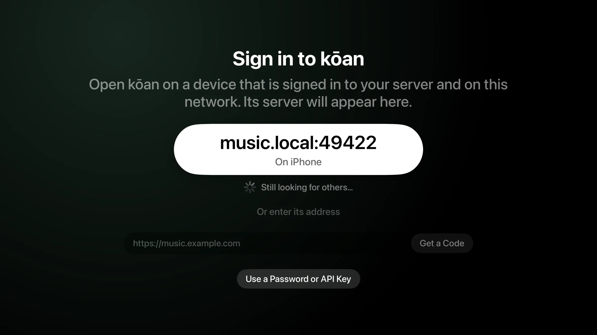
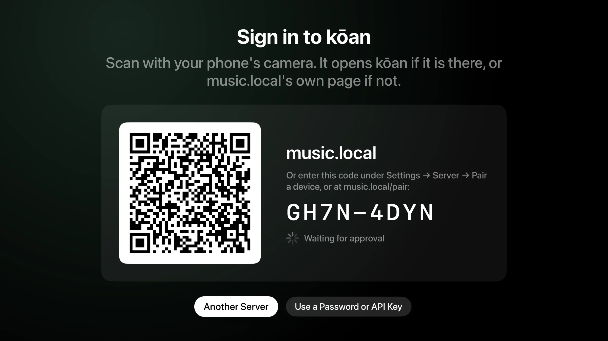
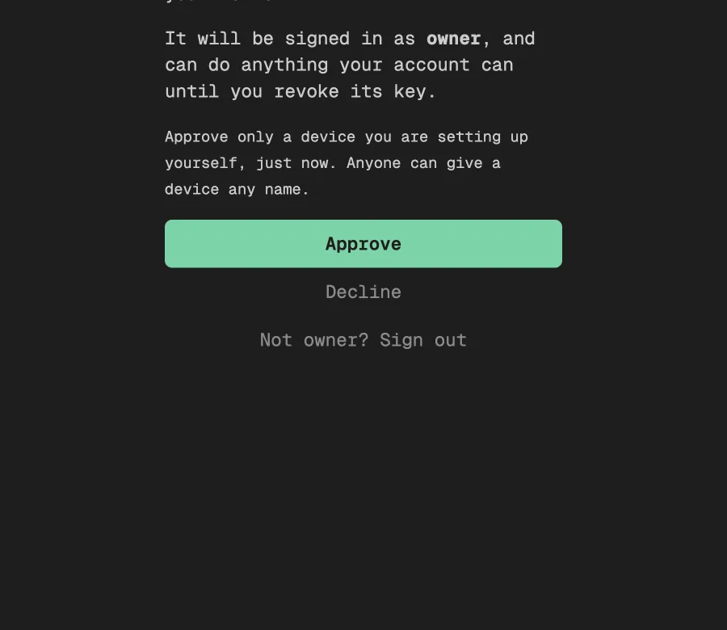
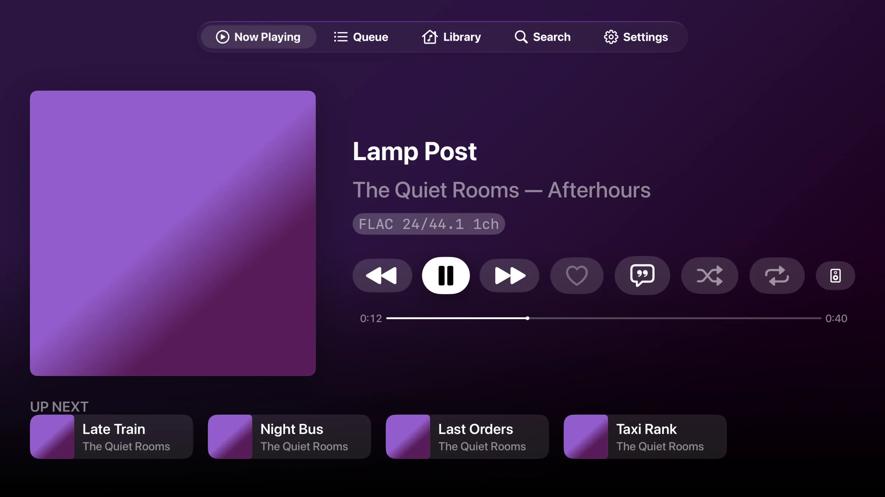

# Apple TV

kōan on Apple TV is the iOS app's engine and pages, built around the remote:
Now Playing first, the tabs across the top, and a long press for a row's
menu. It is mostly something your phone or Mac plays to, through
[Control](devices.md), and it plays gaplessly from your server through HDMI.
It needs tvOS 26.

## Signing in

A television has no keyboard worth typing a password on, so it is signed in
from a device that is already signed in.

1. **It finds your server.** Open kōan on a phone or Mac that is signed in and
   on the same network. The TV lists the server that device uses; press it.
   A device that is not discoverable (Settings → Devices) does not announce its
   server, and the address can always be typed instead.

   

2. **It shows a code.** The TV asks your server for a pairing and shows it as a
   QR code and an eight-character code.

   

3. **You approve it.** Scan the QR code with your phone's camera. With kōan on
   the phone, it asks whether to sign the TV in, and says where the request came
   from. Without kōan, the link opens your server's own page in the browser:
   sign in there and approve it. The code can also be typed under Settings →
   Server → Pair a device on a phone or Mac, or at your server's `/pair` page.

   

4. **It is signed in.** The TV hears the answer at once, signs in with a key of
   its own on your account, and loads your library. The key can be revoked from
   the server like any other.

   

Pairing needs a kōan server from 0.54.0 on. For any other OpenSubsonic server,
"Use a Password or API Key" signs in with an account's password, an API key, or
a kōan invite link pasted from a phone.

The QR code's link goes through koan.rocks only so that a scan opens kōan on
the phone. The server's address and the pairing are in the part of the link
after the `#`, which a browser does not send, so koan.rocks never sees them.

## What it leaves out

It is a device to play on rather than to curate: playlists are made on a phone
or a computer, and the cache looks after itself, so neither is editable on the
TV. DSP profiles are chosen there but imported elsewhere. Share links appear as
a code to scan, since a television has no pasteboard.
